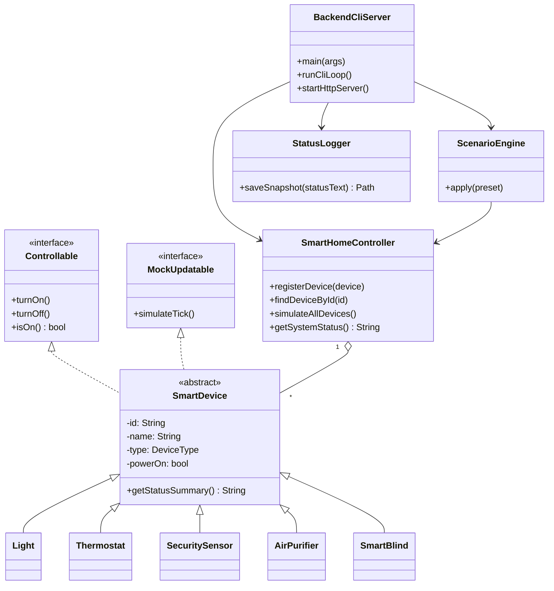
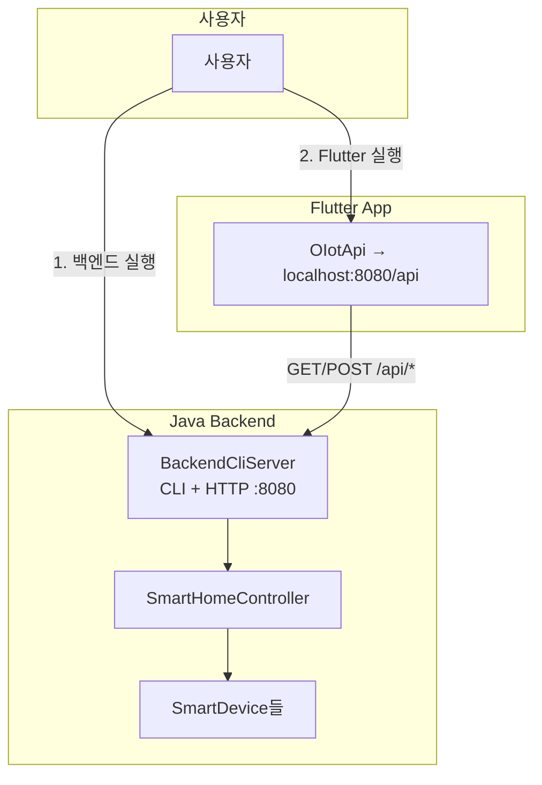
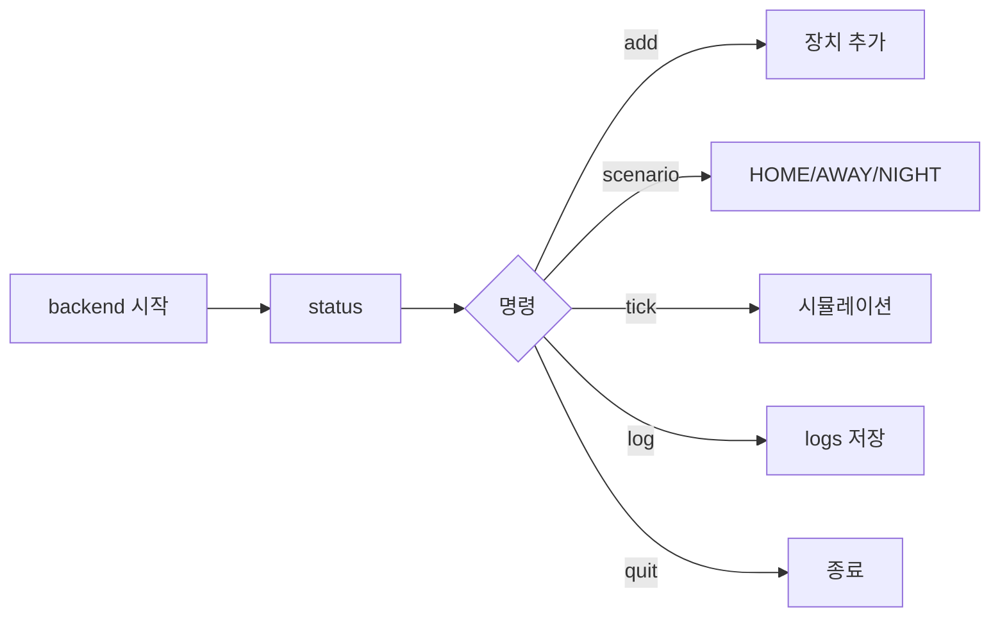
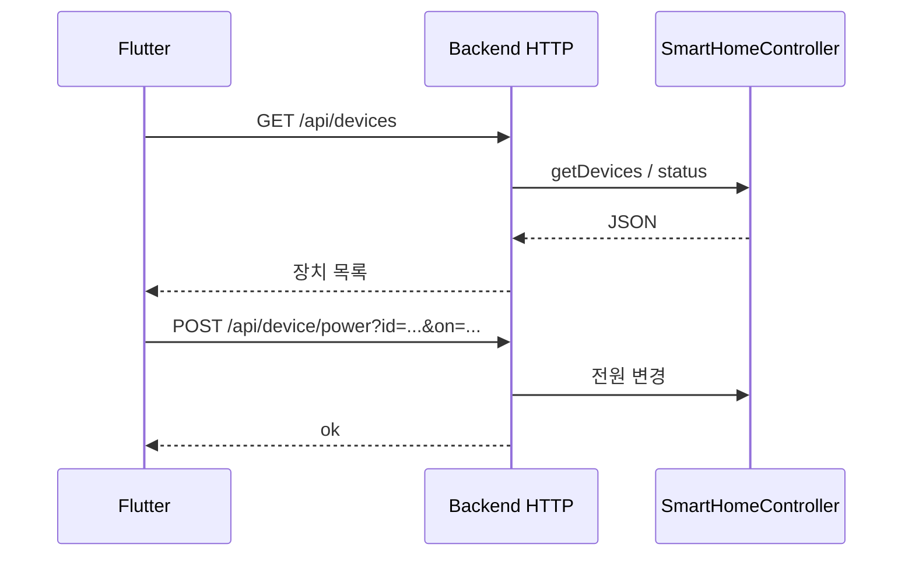

# O-IoT: Object-Oriented Smart Environment Controller

**O-IoT: 객체지향 기반 스마트 환경 제어 시스템**

| 항목 | 내용 |
|------|------|
| **Project members** | **22500735** Choi Yoonsung |
| **Repository** | [https://github.com/csys348/26-JavaProgramming-TeamProject](https://github.com/csys348/26-JavaProgramming-TeamProject) |

---

## Project description

### English

This project is an **Integrated IoT Management System** developed using Java to demonstrate the core principles of Object-Oriented Programming (OOP). By abstracting various hardware components—such as lighting, thermostats, and security sensors—into a hierarchical class structure, the system allows for centralized monitoring and real-time control. To ensure a seamless demonstration, the project includes a **virtual environment built with mock data** to simulate hardware feedback. A **Flutter** mobile UI calls the Java backend over HTTP; **the backend must be running** for the Flutter app to operate.

### 한국어

자바를 활용하여 객체지향 프로그래밍(OOP)의 핵심 원칙을 구현한 **통합 IoT 관리 시스템**이다. 조명, 온도 조절기, 보안 센서 등 다양한 하드웨어를 계층적 클래스 구조로 추상화하여 중앙 집중식 모니터링 및 실시간 제어를 제공한다. 목 데이터(Mock Data) 기반 가상 환경으로 하드웨어 피드백을 시뮬레이션한다. **Flutter** 모바일 UI는 Java 백엔드 HTTP API에 연결되며, **백엔드가 실행 중일 때만** 정상 동작한다.

---

## System overview

- **Backend:** Java `BackendCliServer` — CLI 제어 + `http://localhost:8080/api` REST API
- **Frontend:** Flutter (`oiot_flutter_app/`) — 백엔드 API 호출
- **Logs:** `logs/snapshot_*.log` (백엔드 `log` 명령 또는 API `POST /api/log/save`)

### Build & run

```bash
# 프로젝트 루트에서
mkdir -p out
javac -d out src/oiot/backend/BackendCliServer.java src/oiot/OIoTApplication.java src/oiot/system/StatusLogger.java src/oiot/scenario/ScenarioEngine.java src/oiot/scenario/ScenarioPreset.java src/oiot/devices/SmartBlind.java src/oiot/devices/AirPurifier.java src/oiot/core/DeviceType.java src/oiot/system/SmartHomeController.java src/oiot/devices/SecuritySensor.java src/oiot/devices/Thermostat.java src/oiot/devices/Light.java src/oiot/core/SmartDevice.java src/oiot/core/MockUpdatable.java src/oiot/core/Controllable.java

java -cp out oiot.backend.BackendCliServer
```

```bash
cd oiot_flutter_app
flutter pub get
flutter run
```

---

## UML diagram of classes and interfaces



**실행 결과 캡처(선택):** 아래 이미지는 동일 내용을 IDE/도구에서 렌더링한 화면이다.


*그림 3. 클래스·구조 다이어그램 캡처(제출용)*

---

## User flows (Mermaid)

### 1) 전체 시스템 플로우 (백엔드 선행)



### 2) CLI 사용자 플로우



### 3) Flutter ↔ API 시퀀스



---

## User's guide: how to use your program

### Backend CLI (`oiot.backend.BackendCliServer`)

| 명령 | 설명 |
|------|------|
| `help` | 도움말 |
| `status` | 전체 장치 상태 |
| `tick [n]` | 시뮬레이션 n회 (기본 1) |
| `on <id>` / `off <id>` | 전원 |
| `set <id> <value>` | 옵션 (장치 타입별 범위는 구현 참고) |
| `scenario <HOME\|AWAY\|NIGHT>` | 프리셋 |
| `add <TYPE> <name>` | 장치 추가 |
| `log` | 상태 로그 파일 저장 (`logs/`) |
| `quit` | 종료 |

### REST API (Flutter가 사용)

- `GET /api/health`
- `GET /api/devices`
- `POST /api/device/power?id=&on=`
- `POST /api/device/option?id=&value=`
- `POST /api/device/add?type=&name=`
- `POST /api/scenario?preset=`
- `POST /api/simulate?count=`
- `POST /api/log/save`

### Flutter

1. 백엔드를 먼저 실행한다.
2. `flutter run`으로 앱 실행.
3. **새로고침**으로 장치 목록 로드.
4. 스위치, 프리셋, Tick, 장치 추가, 로그 저장 사용.

---

## Screenshots of program execution with explanation


### 그림 1 — 프로젝트(파일) 구조


*해설: Java 소스(`src/oiot/...`), Flutter 앱(`oiot_flutter_app/`), 로그(`logs/`), 스크린샷(`readme_img/`) 등 저장소 구성을 보여준다.*

### 그림 2 — 백엔드 실행


*해설: `BackendCliServer`가 HTTP 서버(`localhost:8080`)와 CLI 프롬프트(`backend>`)를 함께 띄운 상태이다.*

### 그림 2 — 프론트 실행(터미널)

.png>)

*해설: Flutter 앱을 시뮬레이터/디바이스 대상으로 실행하는 터미널 화면이다.*

### 그림 4 — CLI: 장치 추가 (add LIGHT)


*해설: CLI로 `add LIGHT` 등 장치 추가 후 응답 메시지를 확인한 화면이다.*

### 그림 4 — CLI: 로그 저장


*해설: `log` 명령으로 스냅샷 로그 파일 경로가 출력된 화면이다.*

### 그림 4 — 로그 파일 확인


*해설: `logs/` 디렉터리에 생성된 스냅샷 로그를 확인한 화면이다.*

### 그림 4 — Flutter: 장치 추가 전

.png>)

*해설: 백엔드 연결 후 Flutter 목록에서 특정 시점의 장치 상태이다.*

### 그림 4 — Flutter: 장치 추가 후

.png>)

*해설: 장치 추가 또는 새로고침 이후 목록이 갱신된 화면이다.*

---

## Implementation notes

- 독립 콘솔 데모: `oiot.OIoTApplication` (메뉴 방식)
- 통합 백엔드(권장): `oiot.backend.BackendCliServer` (CLI + HTTP)

---


HTTPS 403이 나오면: GitHub에 로그인한 계정이 해당 repo에 권한이 있는지 확인하거나, SSH 원격(`git@github.com:csys348/26-JavaProgramming-TeamProject.git`)과 배포 키/PAT를 설정한다.
